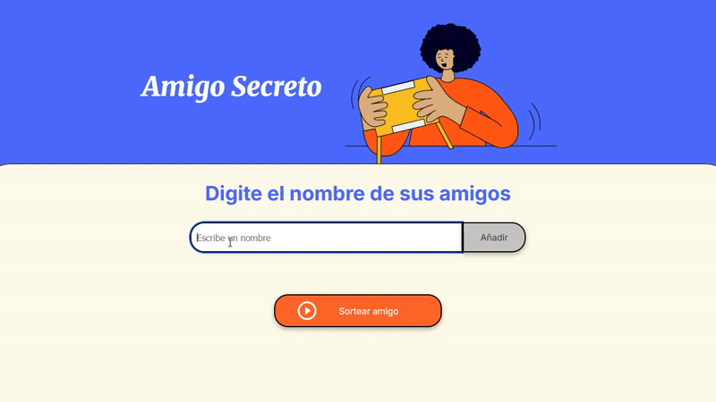

# Challenge 1: Amigo Secreto


 

  

## Introducción

El programa [Oracle Next Education (ONE)](https://www.oracle.com/latam/education/oracle-next-education/) es un programa de educación, inclusión y empleabilidad que forma a personas en tecnología y las conecta con el mercado laboral con el apoyo de empresas asociadas.

Es un programa gratuito que dura 12 meses. Abre inscripciones 2 veces al año donde las personas pueden postular mediante un formulario. Cada generación es enumerada con números arábigos.

El proyecto Amigo Secreto es el Challenge 1 del programa ONE de Oracle y Alura Latam del grupo G9 que inició en julio 2025. Es el primer reto de desarrollo de la fase 2 (para candidatos al programa) después del aprendizaje de los cursos de Lógica de programación, Git y GitHub.

El reto tiene como finalidad poner a prueba a los estudiantes en 2 puntos: programación en JavaScript y uso de Git y GitHub, para ello Alura preparó archivos base HTML y CSS.

## Descripción del proyecto

Amigo Secreto es una herramienta web para realizar sorteos. Ingresa los nombres de los participantes del sorteo y elije al ganador de entre todos los participantes.

## Estado del proyecto

El día 15 de agosto del 2025 se lanzó la versión 1 del proyecto sin modificaciones en el HTML y CSS (archivos base provistos por el programa ONE).

El proyecto se encuentra en su [versión 1.3](#registro-de-cambios).

## Demostración de funciones

El usuario ingresa el nombre de un amigo participante del sorteo en la caja de texto, hace click en el botón Añadir para guardar el nombre del amigo en el arreglo y mostrar la lista de amigos registrados, y cuando haya registrado a todos, hace click en el botón Sortear amigo para elegir al amigo ganador.



## Instalación local

1. Clona el código fuente.

```
git clone https://github.com/PolloRosa/Challenge1-AmigoSecreto.git
```

2. (Opcional) Iniciar un servidor web o la extensión Live Server del Visual Studio Code. Abrir localhost en el navegador.

3. Abrir el archivo `index.html`.

## Registro de cambios

1.3 *15 agosto 2025*

* :sparkles: Agregar funcionalidad de guardar nombre de amigo participante haciendo click en el botón Sortear amigo. Si el usuario ha ingresado un nombre de amigo sin guardar y hace click en el botón Sortear amigo, le saldrá aviso para confirmar el registro del nombre para ser incluido en el sorteo.

1.2.1 *15 agosto 2025*

* :sparkles: Agregar segunda validación para los nombres de los amigos participantes, verifica que no se agreguen nombres de amigos previamente registrados.

1.2.0 *15 agosto 2025*

* :pencil2: Corrección en la función que da formato a los nombres de los amigos participantes.
* :sparkles: Agregar validación para los nombres de los amigos participantes, verifica que no esté en blanco ni tenga solo espacios en blanco.

1.1.0 *15 agosto 2025*

* :sparkles: Agregar formato para los nombres de los amigos participantes cuando son guardados: retira espacios en blanco al inicio y final del nombre, e inicia nombre con mayúsculas.

1.0.0 *15 agosto 2025*

* :white_check_mark: Funcionalidad base solicitada por el Challenge del programa ONE:
* Recibe y guarda los nombres de los amigos participantes del sorteo en un array, el usuario los escribe uno por uno en la caja de texto y hace click en el botón Añadir.
* Muestra la lista de amigos participantes del sorteo debajo de la caja de texto.
* Realiza el sorteo eligiendo a 1 amigo ganador al azar, el usuario hace click en el botón Sortear amigo.
* Muestra los mensajes de error con la función alert.
* :white_check_mark: Funcionalidad adicional:
* Regresa el foco a la caja de texto después de guardado el nombre del amigo participante del sorteo.
* Reinicia después de realizado el sorteo, limpia el array y la lista de nombres mostrada en HTML.

## Autor

Angela Cáceres @PolloRosa :baby_chick:
